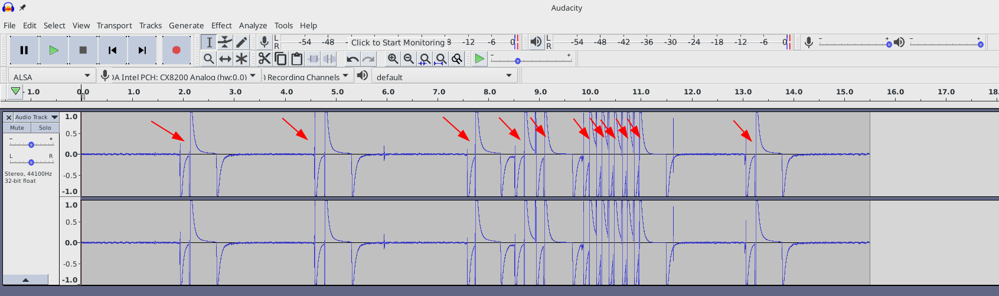

# Headphone Button Control to Mute/Unmute Audio Volume on Linux Laptop

[](http://www.wtfpl.net/about/)

Control the music volume of your laptop with a 1 or 3-buttoned headphone.

## Table of contents <!-- omit in toc -->

- [Introduction](#introduction)
- [Dependencies](#dependencies)
  - [OS and environment](#os-and-environment)
  - [Soundmeter](#soundmeter)
- [Usage](#usage)
  - [Installation](#installation)
  - [Starting to use](#starting-to-use)
  - [Disabling and re-enabling](#disabling-and-re-enabling)
  - [Removal](#removal)
- [Known issues](#known-issues)
- [Disclaimer](#disclaimer)
- [Contact](#contact)

## Introduction

I was looking for a way to be able to control the music playback (start/pause) and volume (up/down) on my laptop with a 3-button headphone, just as some Android phones do. After lots of searches, I figured it out that there is no standard way to achieve this (e.g., with `xev` or `dmesg`), so I decided to create my solution based on microphone sound input volume. If you see the below picture, with 100% mic input volume, the headset button clicks are identifiable clearly in a quiet room. 



After some trials and errors, I settled with only being able to **mute and unmute the music volume** with a button click. Maybe there is a better way of doing this, or there is a way to achieve more of the original goal, but it suits my needs as of now (i.e., being able to listen to anybody quickly).

## Dependencies

### OS and environment

I use [Manjaro Linux KDE](https://manjaro.org/download/kde/) with up-to-date [Python](https://www.python.org/), [`pip`](https://pip.pypa.io/en/stable/installing/), [Git](https://git-scm.com/) and [`amixer`](https://linux.die.net/man/1/amixer) installed by default _(or at least I forgot over the time I installed some)_. Manjaro is not necessarily needed, but we are going to use the other tools in this project. As of writing, the current versions are:

```bash
uname -a
# Linux think-pc 4.19.12-2-MANJARO #1 SMP PREEMPT Sun Dec 23 19:08:00 UTC 2018 x86_64 GNU/Linux

python -V
# Python 3.7.1

pip -V
# pip 18.1 from /usr/lib/python3.7/site-packages/pip (python 3.7)

git --version
# git version 2.19.2

amixer --version
# amixer version 1.1.7
```

### Soundmeter 

Soundmeter is a Python package that lets us read microphone input volume. See the detailed instructions and examples here: [https://pypi.org/project/soundmeter/](https://pypi.org/project/soundmeter/) _(There might be some dependencies that are installed by default on Manjaro, and you need to get it manually on another distro, check the link.)_

Install steps on Manjaro:

```bash
# enter sudo password when prompted to install soundmeter
sudo pip install soundmeter
```

Try it out if it works and what levels your headphone button click produces:

```bash
# basic reading, end the process with CTRL+C
soundmeter
```

Mine is usually around ~200-300. When I speak or accidentally touch the cord, it peaks around ~4000-5000. However, button clicks are around ~15000-19000, so I'll use `16000` as trigger level (with 100% mic volume). 

If you see some warnings/errors in the output, ignore it if the volume level is displayed successfully at the last line.

```bash
soundmeter
# connect(2) call to /dev/shm/jack-1000/default/jack_0 failed (err=No such file or directory)
# attempt to connect to server failed
# connect(2) call to /dev/shm/jack-1000/default/jack_0 failed (err=No such file or directory)
# attempt to connect to server failed
# connect(2) call to /dev/shm/jack-1000/default/jack_0 failed (err=No such file or directory)
# attempt to connect to server failed
#      16962
```

## Usage

### Installation

Clone the repository somewhere, and then you can install the `headphonebc` service:

```bash
# enter sudo password when prompted to clone into /opt and install the service
sudo git clone https://github.com/immanuelfodor/laptop-headphone-control /opt/headphonebc
/opt/headphonebc/src/manage.sh install
# should display 'Active: active (running)' when successfully started
```

Congrats, the service is up and running now! :tada:

Notes:
- The `install` step also tries to `enable` the service for the current user, no need to run it separately.
- The above `connect(2) call to /dev/shm/...` warnings/errors can be present in the `systemctl status` output without volume level at the end. These lines are part of normal behavior, don't worry. 
- If you see `Active: failed` and `(code=exited, status=1/FAILURE)` messages in the `systemctl status` output, close all open soundcard-related windows (e.g., Pulse Audio Settings), then run the `enable` (or `install`) commands multiple times to solve it.

### Starting to use

The service runs in the background and listens to headphone button clicks. You can now try it out! Press the button of your headphone to see if it works. _Sometimes you need to press it twice to let the click to be heard and recognized._

You can also check the status of the service with these commands:

```bash
# enter sudo password when prompted to check the status of the service
/opt/headphonebc/src/manage.sh status

# triggered script log stream view, end the inspection process with CTRL+C
journalctl -b -t headphonebc -f
```

### Disabling and re-enabling

If you want to disable the service temporarily (or later re-enable it), you can do so with these commands:

```bash
# enter sudo password when prompted to manage the service
/opt/headphonebc/src/manage.sh disable
/opt/headphonebc/src/manage.sh enable
```

### Removal

Run this command if you want to delete the service from your laptop:

```bash
# enter sudo password when prompted to remove the service
/opt/headphonebc/src/manage.sh remove
```

Note: the `remove` step also tries to `disable` the service for the current user, no need to run it separately.

## Known issues

- Sometimes `soundmeter` is unable to initialize, and so the service fails to start up. This usually happens when a soundcard-related window is open (e.g., Pulse Audio Settings). Running the `enable` (or `install`) commands multiple times can solve it. This is the log output when it happens:

```python
Expression 'paInvalidSampleRate' failed in 'src/hostapi/alsa/pa_linux_alsa.c', line: 2043
Expression 'PaAlsaStreamComponent_InitialConfigure( &self->capture, inParams, self->primeBuffers, hwParamsCapture>
Expression 'PaAlsaStream_Configure( stream, inputParameters, outputParameters, sampleRate, framesPerBuffer, &inpu>
Traceback (most recent call last):
  File "/usr/bin/soundmeter", line 11, in <module>
    load_entry_point('soundmeter==0.1.5', 'console_scripts', 'soundmeter')()
  File "/usr/lib/python3.7/site-packages/soundmeter/meter.py", line 321, in main
    m = Meter(**kwargs)
  File "/usr/lib/python3.7/site-packages/soundmeter/meter.py", line 66, in __init__
    frames_per_buffer=self.config.FRAMES_PER_BUFFER)
  File "/usr/lib/python3.7/site-packages/pyaudio.py", line 750, in open
    stream = Stream(self, *args, **kwargs)
  File "/usr/lib/python3.7/site-packages/pyaudio.py", line 441, in __init__
    self._stream = pa.open(**arguments)
OSError: [Errno -9997] Invalid sample rate
```

- When the mic volume is set to lower than 100% in the OS volume settings, the volume of the button click can be below the trigger's threshold. You should always set it to 100% to overcome this issue.
- My service settings might not suit your needs with a different headphone and/or laptop. If you want to tune the trigger's threshold (`-t`) or the interval of the recording (`--segment`), you can now only do it in the `headphonebc@.service` file. Run the `remove` and `install` commands in this order to apply any changes to the service. It is advisable to run the command after the `ExecStart=` key in a separate console window for testing purposes, and then only copy the perfect settings back to apply as a service.
- As the mic input is used to determine clicks, I accidentally found out that a sneeze also counts as a click :grinning: You can also mute/unmute the sound by blowing directly into the mic _(fun)_.
- As the service is run by `systemd`, the environment is different from your user's env. This is why muting equals to ~6% of volume (at least on my laptop), and unmuting restores the original volume with ~1-3% difference than the original volume. If you want complete silence, look into the `headphonebc.sh` file.
- It would be nice to create an AUR package from this repo.

## Disclaimer

**This is an experimental project. I do not take responsibility for anything regarding the use or misuse of the contents of this repository.**

Tested with the below configuration. In theory, it should work with any laptop and headphone that produce a high clicking sound when the (main) headphone button is pressed, and the microphone can take it up.

- Laptop
  - Lenovo ThinkPad X380 Yoga 
- Headphones
  - Audio-technica ATH-MSR7
  - JBL Synchros S200a
  - Sennheiser CX 5.00G
- Soundmeter
  - 0.1.5

## Contact

Immánuel Fodor    
[fodor.it](https://fodor.it/headphonebcit) | [Linkedin](https://fodor.it/headphonebcin)
